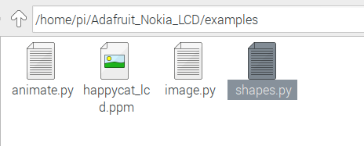
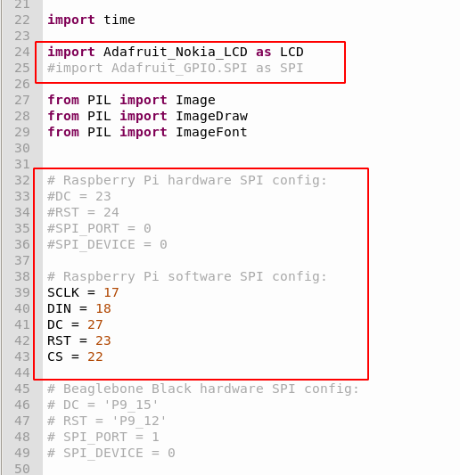
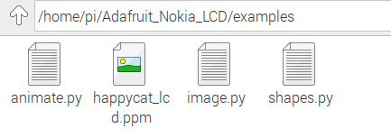

documenting for raspberry pi club rpi 1.6inch screen module.

# 液晶屏硬件接口   

液晶引脚定义  |  BCM GPIO号 | WiringPi接口号   
----------  |  ----------|  ----------
CLK  |	BCM.17|GP0
DIN  |  BCM.18|GP1
D/C  |  BCM.27|GP2
CE  |  BCM.22|GP3
RST  |  BCM.23|GP4
BL*  |  BCM.4|GP7

BL* 为背光开关控制引脚。需要在液晶屏幕背后把跳线焊盘进行短路后，才能和树莓派GPIO进行物理相通。使用时，*务必把背光开关置与OFF档位*。


# 软件安装指南 

```
#安装python库
sudo apt-get install python-pip python-dev build-essential   

sudo pip install RPi.GPIO
```

```
#下载测试demo软件
git clone https://github.com/adafruit/Adafruit_Nokia_LCD.git
cd Adafruit_Nokia_LCD
sudo python setup.py install
```

跟改相应的GPIO接口：(以examples/shapes.py为例)   
    

首先屏蔽硬件SPI调用，其次定义软件GPIO接口   


调用软件IO口驱动液晶：   


*已经改好的3个python程序，已经上传到这个代码库里面（下载到本地，直接覆盖源文件即可）:*   



```
运行代码：
程序1：   
python ./shapes.py
程序2：
python ./image.py 
程序3：
python ./animate.py
```